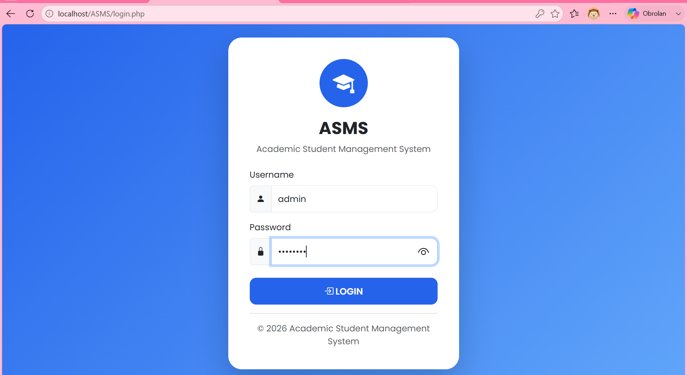
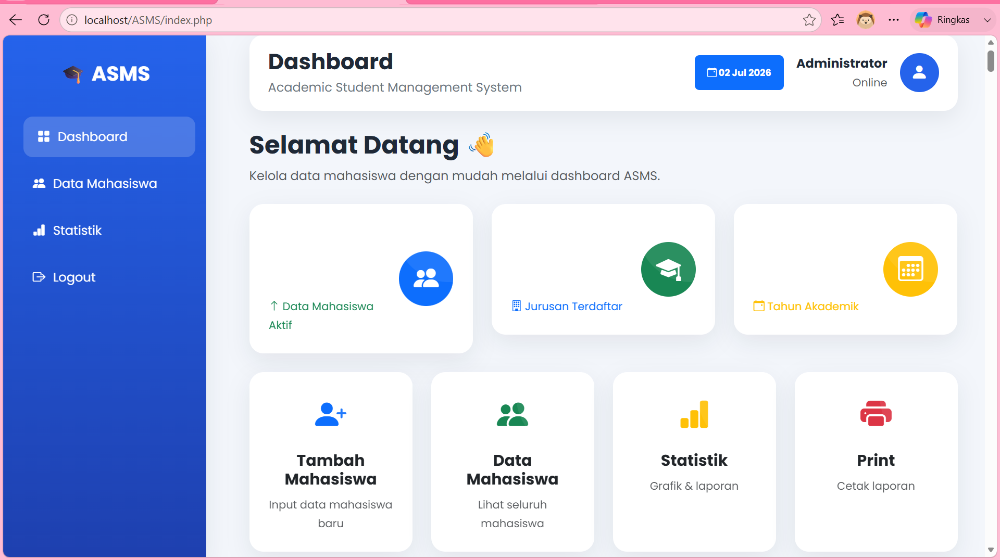
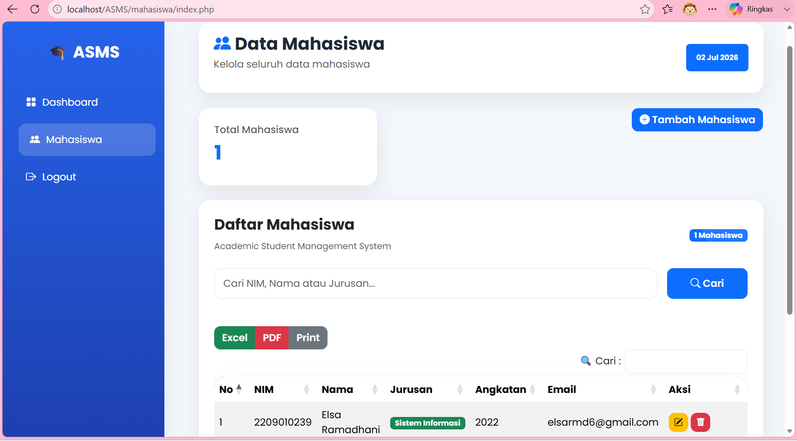
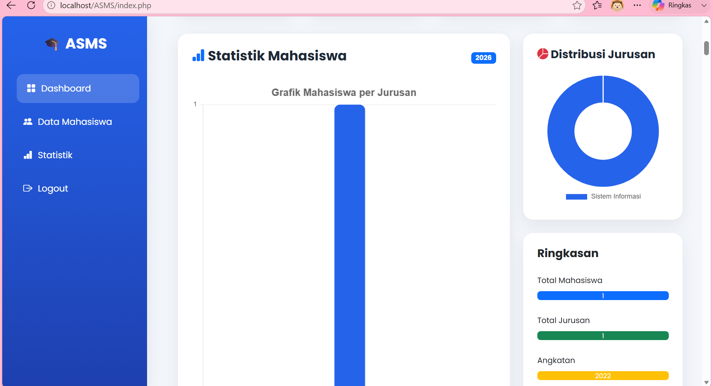

# 🎓 Academic Student Management System (ASMS)

A modern web-based Academic Student Management System developed using PHP Native, MySQL, Bootstrap 5, Chart.js, DataTables, and SweetAlert2. This application provides an intuitive dashboard for managing student records, visualizing academic statistics, and performing complete CRUD operations efficiently.

---

## ✨ Features

- 📊 Interactive Dashboard with Chart.js
- 👨‍🎓 Student Management (CRUD)
- 🔍 Search & Pagination
- 📄 Export to Excel
- 📑 Export to PDF
- 🖨️ Print Student Data
- 📱 Responsive User Interface
- 🔔 SweetAlert2 Notifications
- 📈 Student Statistics by Major
- 🎨 Modern Dashboard Design

---

## 📸 Screenshots

### 🔐 Login Page

Modern login interface with a clean and responsive design.



---

### 📊 Dashboard

Dashboard displaying student statistics, charts, and quick actions.



---

### 👨‍🎓 Student Management

Manage student records with CRUD operations, search, export, and print features.



---

### 📈 Student Statistics

Interactive visualization of student distribution by major.



---

## 🛠 Tech Stack

- PHP Native
- MySQL
- Bootstrap 5
- HTML5
- CSS3
- JavaScript
- Chart.js
- DataTables
- SweetAlert2

---

## 📂 Project Structure

```text
ASMS
│
├── assets/
│   ├── css/
│   ├── icons/
│   └── js/
│
├── config/
│   └── db.php
│
├── mahasiswa/
│   ├── index.php
│   ├── tambah.php
│   ├── edit.php
│   └── delete.php
│
├── screenshots/
├── login.php
├── logout.php
├── index.php
└── README.md
```

---

## 🚀 Installation

1. Clone this repository

```bash
git clone https://github.com/ElsaRamadhani/academic-student-management-system.git
```

2. Move the project to the **htdocs** folder (XAMPP).

3. Import the database into **phpMyAdmin**.

4. Configure the database connection in:

```text
config/db.php
```

5. Start **Apache** and **MySQL** from XAMPP.

6. Open the application:

```text
http://localhost/asms
```

---

## 🎯 Main Features

- Dashboard Analytics
- Student Data Management
- Student Statistics
- Export Reports
- Responsive Interface
- Secure Login System

---

## 👩‍💻 Author

**Elsa Ramadhani**

GitHub: https://github.com/ElsaRamadhani

---

⭐ If you like this project, don't forget to give it a **Star** on GitHub!
